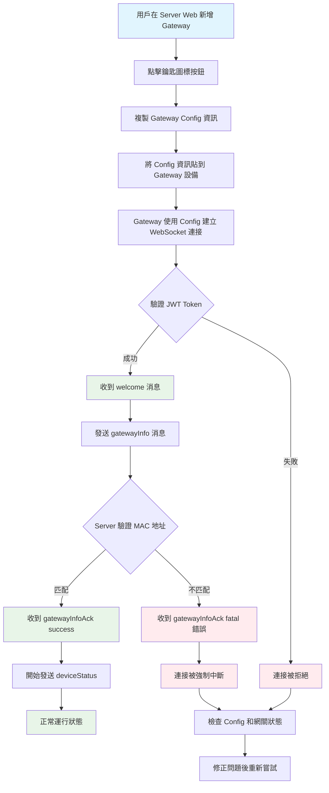
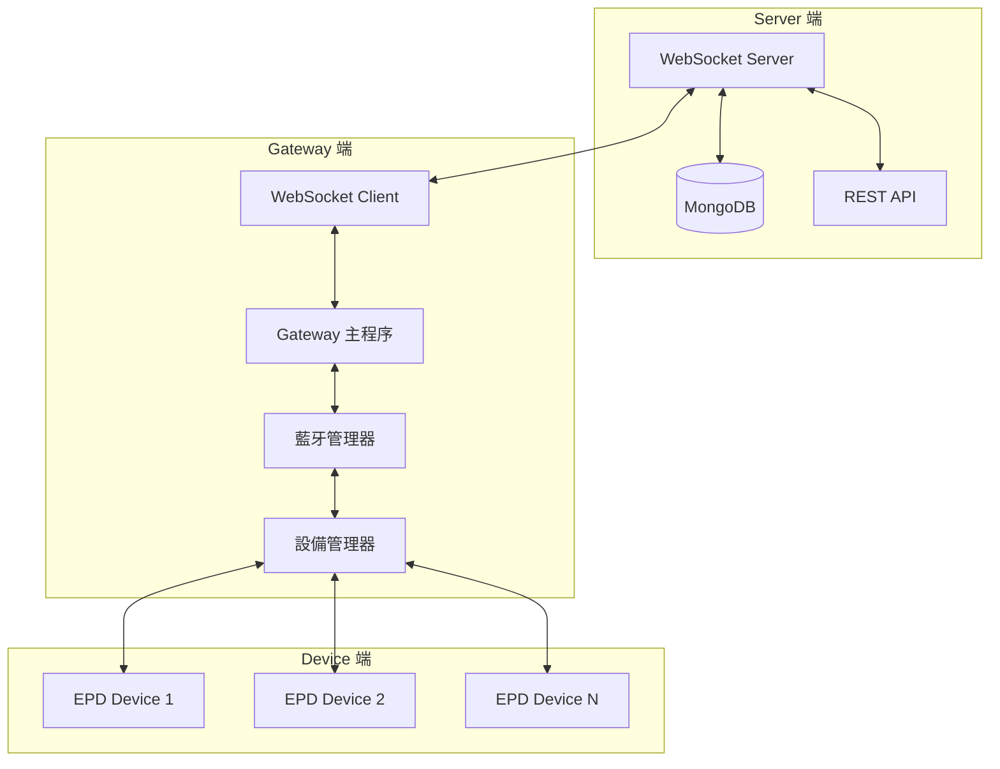
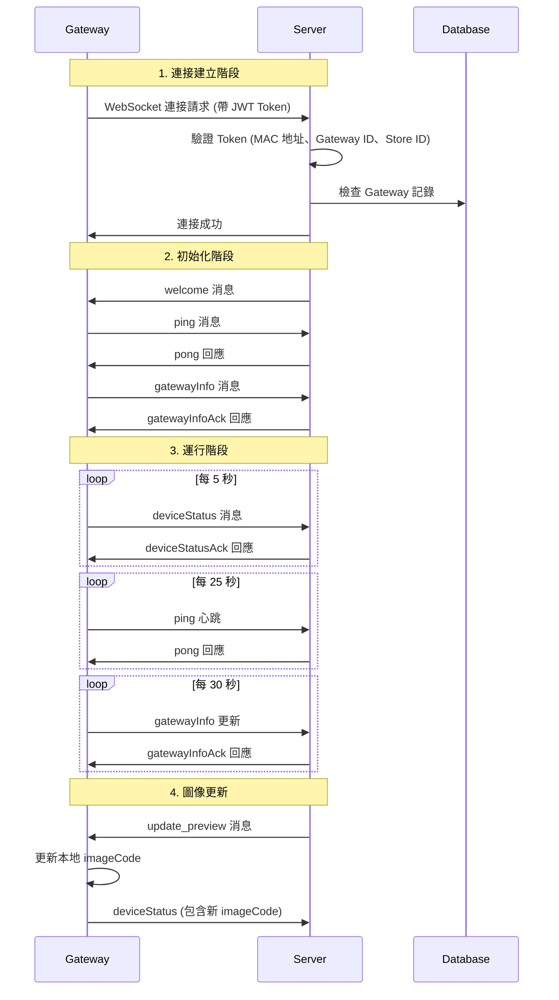
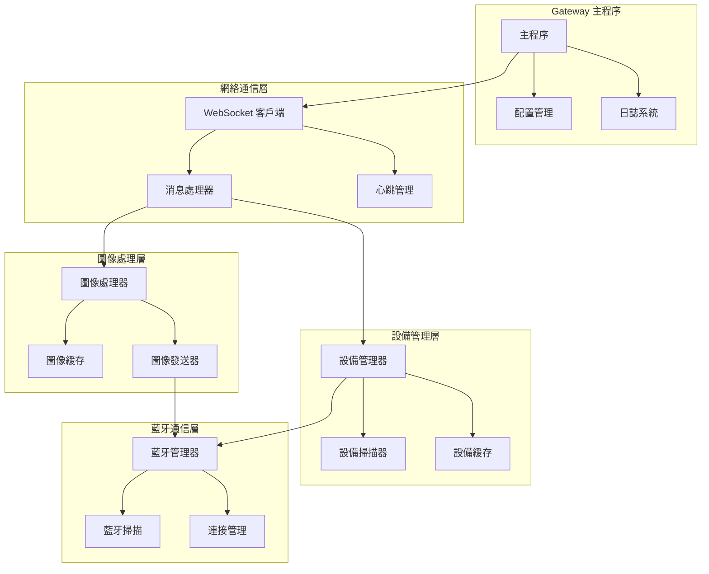
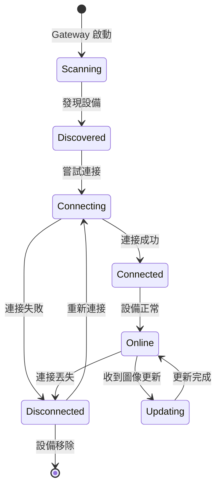
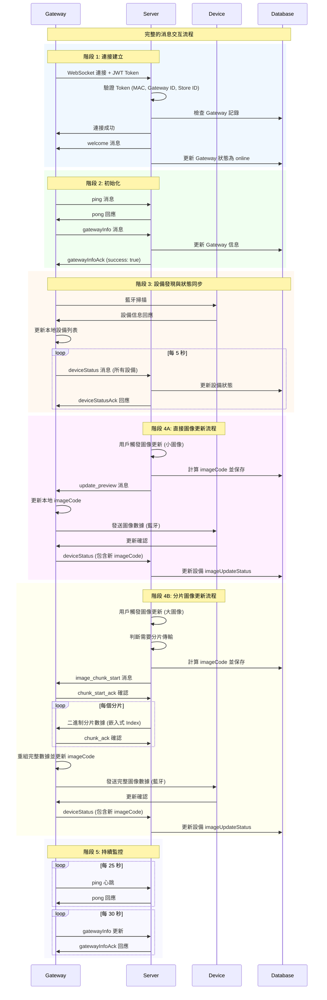
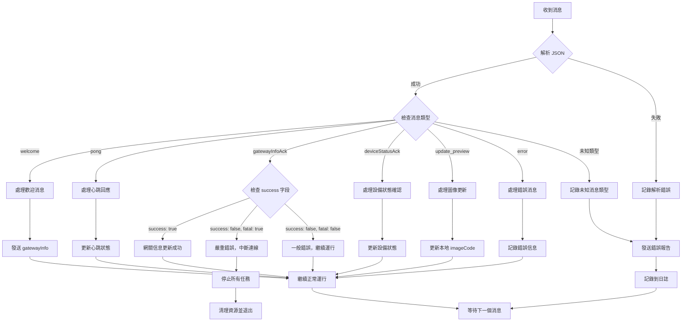
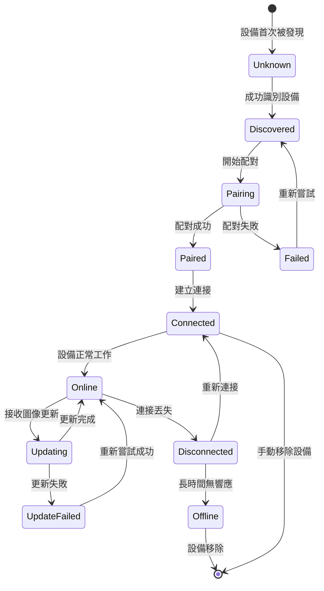

# Gateway/Device 實作指南

## 概述

本文件為 Gateway/Device 實作人員提供與 Server 溝通的完整協議規範和架構指南。

## 🔄 操作流程概覽



## 目錄

1. [操作流程詳解](#操作流程詳解)
2. [系統架構概覽](#系統架構概覽)
3. [WebSocket 連接流程](#websocket-連接流程)
4. [消息協議規範](#消息協議規範)
5. [失敗狀況與錯誤回應](#失敗狀況與錯誤回應)
6. [Gateway 內部架構](#gateway-內部架構)
7. [Device 管理架構](#device-管理架構)
8. [錯誤處理機制](#錯誤處理機制)
9. [安全考量](#安全考量)
10. [實作範例](#實作範例)

## 操作流程詳解

### 1. Server 端準備
1. **新增 Gateway**: 用戶在 Server Web 管理界面新增 Gateway 記錄
2. **獲取 Config**: 點擊鑰匙圖標按鈕，複製包含 JWT Token 的 Gateway Config 資訊
3. **Config 格式**:
   ```json
   {
     "url": "ws://server-ip:port/ws",
     "token": "eyJhbGciOiJIUzI1NiIsInR5cCI6IkpXVCJ9...",
     "protocol": "json"
   }
   ```

### 2. Gateway 端配置
1. **接收 Config**: 將複製的 Config 資訊貼到 Gateway 設備
2. **解析 Config**: Gateway 解析 JSON 格式的配置信息
3. **建立連接**: 使用 Config 中的 URL 和 Token 建立 WebSocket 連接

### 3. 連接驗證流程
1. **JWT 驗證**: Server 驗證 Token 的有效性、類型、MAC 地址等
2. **歡迎消息**: 驗證成功後 Server 發送 welcome 消息
3. **網關註冊**: Gateway 收到 welcome 後立即發送 gatewayInfo 消息
4. **開始通信**: 註冊成功後開始定期發送 deviceStatus 消息

## 系統架構概覽



## WebSocket 連接流程

### 1. 連接建立流程圖



### 2. 連接參數

**WebSocket URL 格式：**
```
ws://server-ip:port/ws?token=JWT_TOKEN
```

**JWT Token 內容：**
```json
{
  "type": "gateway",
  "gatewayId": "gateway_object_id",
  "storeId": "store_object_id",
  "macAddress": "AA:BB:CC:DD:EE:FF",
  "iat": 1640995200,
  "exp": 1640998800
}
```

## 消息協議規範

### 1. 發送消息格式 (Gateway → Server)

#### 1.1 ping 消息 (心跳)
```json
{
  "type": "ping",
  "timestamp": 1640995200000
}
```

**發送頻率：** 每 25 秒
**用途：** 保持連接活躍，防止超時斷線

#### 1.2 gatewayInfo 消息 (網關信息)
```json
{
  "type": "gatewayInfo",
  "info": {
    "macAddress": "AA:BB:CC:DD:EE:FF",
    "model": "Gateway Model 003",
    "wifiFirmwareVersion": "1.0.0",
    "btFirmwareVersion": "2.0.0",
    "ipAddress": "192.168.1.100",

    // 新增：分片傳輸能力支援
    "chunkingSupport": {
      "enabled": true,                 // 是否支援分片傳輸
      "maxChunkSize": 200,            // 每個分片的最大大小（4 bytes - 512KB）
      "embeddedIndex": true,          // 是否支援嵌入式 Index 模式
      "jsonHeader": true              // 是否支援 JSON Header 模式（向後兼容）
    }
  }
}
```

**發送時機：**
- 收到 welcome 消息後立即發送
- 每 30 秒定期更新
- 網關信息變更時

**重要注意事項：**
- `macAddress` 必須與 JWT Token 中的 MAC 地址完全一致
- 如果不匹配，Server 會強制中斷連線並記錄安全事件
- `chunkingSupport` 決定 Server 是否對該 Gateway 啟用分片傳輸
- `maxChunkSize` 應根據硬體記憶體限制設定，支援範圍 4 bytes - 512KB

#### 1.3 deviceStatus 消息 (設備狀態)
```json
{
  "type": "deviceStatus",
  "devices": [
    {
      "macAddress": "11:22:33:44:55:66",
      "status": "online",
      "data": {
        "size": "2.9\"",
        "battery": 85,
        "rssi": -65,
        "colorType": "BW",
        "imageCode": "12345678"
      }
    }
  ]
}
```

**發送頻率：** 每 5 秒
**設備狀態字段說明：**
- `macAddress`: 設備 MAC 地址 (必填)
- `status`: 設備狀態 ("online"/"offline")
- `data.size`: 螢幕尺寸 (如 "2.9\"", "4.2\"")
- `data.battery`: 電池電量 (0-100)
- `data.rssi`: 信號強度 (負數)
- `data.colorType`: 顏色類型 ("BW"/"BWR"/"BWRY")
- `data.imageCode`: 當前顯示的圖像代碼 (可選)

**重要注意事項：**
- **不包含 `dataId`**: 這是由前端或API控制的欄位，不是由裝置自己回報的欄位
- **imageCode 處理邏輯：**
  - 設備回報不應主動包含 `imageCode`
  - 只有在本地存儲有 `imageCode` 時才包含此字段
  - 當收到 Server 的圖像更新時，更新本地 `imageCode`
  - 下次狀態回報時包含更新後的 `imageCode`

#### 1.4 chunk_start_ack 消息 (分片開始確認)
```json
{
  "type": "chunk_start_ack",
  "chunkId": "chunk_12345",
  "status": "ready",
  "error": null,
  "timestamp": 1640995200000
}
```

**發送時機：** 收到 `image_chunk_start` 消息後立即發送
**用途：** 確認已準備好接收分片數據

**參數說明：**
- `status`: 操作狀態
  - `"ready"`: 已準備好接收分片數據
  - `"error"`: 準備過程中發生錯誤
- `error`: 錯誤信息（當 status 為 "error" 時提供具體錯誤描述，否則為 null）

#### 1.5 chunk_ack 消息 (分片確認)
```json
{
  "type": "chunk_ack",
  "chunkId": "chunk_12345",
  "chunkIndex": 5,
  "status": "received",
  "error": null,
  "timestamp": 1640995200000
}
```

**發送時機：** 收到每個分片數據後立即發送
**用途：** 確認已成功接收該分片，Server 可以發送下一個分片

**參數說明：**
- `status`: 分片接收狀態
  - `"received"`: 分片已成功接收並存儲
  - `"duplicate"`: 檢測到重複分片（已接收過）
  - `"error"`: 分片接收或處理過程中發生錯誤
- `error`: 錯誤信息（當 status 為 "error" 時提供具體錯誤描述，否則為 null）

#### 1.6 chunk_complete_ack 消息 (分片完成確認)
```json
{
  "type": "chunk_complete_ack",
  "chunkId": "chunk_12345",
  "status": "success",
  "receivedSize": 9484,
  "error": null,
  "timestamp": 1640995200000
}
```

**發送時機：** 收到 `image_chunk_complete` 消息後立即發送
**用途：** 確認所有分片已接收完成並成功重組

**參數說明：**
- `status`: 完成狀態
  - `"success"`: 所有分片已成功接收並重組完成
  - `"error"`: 分片重組過程中發生錯誤
- `receivedSize`: 實際接收到的數據總大小（bytes）
- `error`: 錯誤信息（當 status 為 "error" 時提供具體錯誤描述，否則為 null）

### 2. 接收消息格式 (Server → Gateway)

#### 2.1 welcome 消息 (歡迎)
```json
{
  "type": "welcome",
  "message": "WebSocket 連接成功",
  "timestamp": 1640995200000,
  "gatewayInfo": {
    "gatewayId": "gateway_object_id",
    "storeId": "store_object_id",
    "macAddress": "AA:BB:CC:DD:EE:FF"
  },
  "serverInfo": {
    "time": "2021-12-31T16:00:00.000Z",
    "version": "1.0.0"
  }
}
```

**處理邏輯：**
- 收到此消息表示連接成功建立
- 應立即發送 `gatewayInfo` 消息回應

#### 2.2 pong 消息 (心跳回應)
```json
{
  "type": "pong",
  "timestamp": 1640995200000,
  "serverTime": 1640995200100
}
```

**處理邏輯：**
- 確認心跳消息已被 Server 接收
- 可用於計算網絡延遲

#### 2.3 gatewayInfoAck 消息 (網關信息確認)
```json
{
  "type": "gatewayInfoAck",
  "timestamp": 1640995200000,
  "success": true,
  "message": "網關信息更新成功"
}
```

**錯誤情況：**
```json
{
  "type": "gatewayInfoAck",
  "timestamp": 1640995200000,
  "success": false,
  "message": "MAC地址不匹配，連線已中斷",
  "fatal": true
}
```

**處理邏輯：**
- `success: true`: 網關信息更新成功
- `success: false, fatal: true`: 嚴重錯誤，連線將被強制中斷
- `success: false, fatal: false`: 一般錯誤，可繼續運行

#### 2.4 deviceStatusAck 消息 (設備狀態確認)
```json
{
  "type": "deviceStatusAck",
  "timestamp": 1640995200000,
  "success": true,
  "message": "設備狀態更新成功",
  "detailStatus": [
    {
      "macAddress": "11:22:33:44:55:66",
      "status": "success",
      "deviceId": "device_object_id"
    }
  ]
}
```

#### 2.5 update_preview 消息 (圖像更新 - 直接傳輸)
```json
{
  "type": "update_preview",
  "deviceMac": "11:22:33:44:55:66",
  "imageData": "data:image/png;base64,iVBORw0KGgoAAAANSUhEUgAA...",
  "imageCode": "87654321",
  "rawdata": [255, 255, 0, 128, 64, ...],  // EPD 原始數據陣列 (Uint8Array)
  "timestamp": "2021-12-31T16:00:00.000Z"
}
```

**處理邏輯：**
1. 接收圖像數據並保存到設備
2. 更新本地存儲的 `imageCode`
3. 使用 `rawdata` 中的 EPD 二進制數據直接發送到設備顯示
4. 下次 `deviceStatus` 回報時包含新的 `imageCode`

**rawdata 字段說明：**
- 包含轉換後的 EPD 格式二進制數據
- 數據格式根據設備的 colorType 而定 (BW/BWR/BWRY)
- 包含 ImageInfo 結構 (12 bytes) + 像素數據
- 可直接發送到 EPD 設備進行顯示，無需額外轉換

#### 2.6 image_chunk_start 消息 (分片傳輸開始)
```json
{
  "type": "image_chunk_start",
  "chunkId": "chunk_12345",
  "deviceMac": "11:22:33:44:55:66",
  "imageCode": "87654321",
  "totalChunks": 48,
  "totalSize": 9484,
  "chunkSize": 200,
  "indexSize": 4,
  "dataType": "rawdata",
  "mode": "embedded_index",
  "timestamp": "2021-12-31T16:00:00.000Z"
}
```

**處理邏輯：**
1. 準備接收分片數據，初始化接收緩衝區
2. 記錄分片參數（總分片數、分片大小等）
3. 立即發送 `chunk_start_ack` 確認
4. 等待接收二進制分片數據

**字段說明：**
- `chunkId`: 唯一識別符，用於關聯所有分片
- `totalChunks`: 總分片數量
- `totalSize`: 原始數據總大小（不包含 index）
- `chunkSize`: 每個分片的實際數據大小
- `indexSize`: 每個分片前綴的 index 大小（固定 4 bytes）
- `mode`: "embedded_index" 表示使用嵌入式 Index 模式

#### 2.7 二進制分片數據
**格式：**
```
[4 bytes: chunkIndex][N bytes: 實際數據]
```

**處理邏輯：**
1. 解析前 4 bytes 獲取 chunkIndex (little-endian)
2. 提取後續的實際數據
3. 按 chunkIndex 順序存儲到接收緩衝區
4. 立即發送 `chunk_ack` 確認
5. 檢查是否已接收所有分片
6. 完成後重組完整數據並更新 imageCode

**重要注意事項：**
- chunkIndex 是 32位無符號整數，little-endian 格式
- 必須按順序重組分片，不能遺漏任何分片
- 每個分片接收後必須立即發送 ACK
- 超時未收到分片時，Server 會自動重傳

#### 2.8 image_chunk_complete 消息 (分片傳輸完成)
```json
{
  "type": "image_chunk_complete",
  "chunkId": "chunk_12345",
  "deviceMac": "11:22:33:44:55:66",
  "imageCode": "87654321",
  "totalChecksum": "a1b2",
  "timestamp": "2021-12-31T16:00:00.000Z"
}
```

**處理邏輯：**
1. 驗證所有分片是否已正確接收
2. 檢查數據完整性（可選：使用 totalChecksum）
3. 完成圖像數據重組
4. 更新本地 imageCode
5. 發送 `chunk_complete_ack` 確認

**字段說明：**
- `totalChecksum`: 完整數據的校驗碼（可選，用於驗證數據完整性）

#### 2.9 error 消息 (錯誤)
```json
{
  "type": "error",
  "message": "處理消息時發生錯誤",
  "error": "具體錯誤信息",
  "timestamp": 1640995200000
}
```

## 失敗狀況與錯誤回應

### 1. 連接階段失敗

#### 1.1 Token 驗證失敗
**狀況**: JWT Token 無效、過期或格式錯誤
```
WebSocket 連接被拒絕
HTTP 狀態碼: 401 Unauthorized
原因: "Authentication failed"
```

**可能原因**:
- Token 已過期
- Token 格式不正確
- Token 簽名無效
- 缺少 Token 參數

#### 1.2 Token 類型錯誤
**狀況**: Token 不是 gateway 類型
```
WebSocket 連接被拒絕
HTTP 狀態碼: 401 Unauthorized
原因: "Invalid token type"
```

#### 1.3 Gateway ID 不匹配
**狀況**: URL 路徑中的 Gateway ID 與 Token 中的不匹配
```
WebSocket 連接被拒絕
HTTP 狀態碼: 403 Forbidden
原因: "Gateway ID mismatch"
```

#### 1.4 Store ID 不匹配
**狀況**: URL 路徑中的 Store ID 與 Token 中的不匹配
```
WebSocket 連接被拒絕
HTTP 狀態碼: 403 Forbidden
原因: "Store ID mismatch"
```

#### 1.5 MAC 地址缺失
**狀況**: Token 中缺少 MAC 地址信息
```
WebSocket 連接被拒絕
HTTP 狀態碼: 403 Forbidden
原因: "MAC address missing in token"
```

### 2. 運行階段失敗

#### 2.1 MAC 地址不匹配 (致命錯誤)
**狀況**: gatewayInfo 中的 MAC 地址與 Token 中的不匹配
```json
{
  "type": "gatewayInfoAck",
  "timestamp": 1640995200000,
  "success": false,
  "message": "MAC地址不匹配，連線已中斷",
  "fatal": true
}
```
**後果**: 連接被強制中斷，記錄安全事件

#### 2.2 網關被刪除
**狀況**: 網關在連接期間被從系統中刪除
```json
{
  "type": "gatewayInfoAck",
  "timestamp": 1640995200000,
  "success": false,
  "message": "找不到指定的網關",
  "fatal": false
}
```

#### 2.3 網關信息無效
**狀況**: gatewayInfo 消息格式錯誤或缺少必要字段
```json
{
  "type": "gatewayInfoAck",
  "timestamp": 1640995200000,
  "success": false,
  "message": "網關信息無效",
  "fatal": false
}
```

#### 2.4 設備狀態處理失敗
**狀況**: deviceStatus 消息處理時發生錯誤
```json
{
  "type": "deviceStatusAck",
  "timestamp": 1640995200000,
  "success": false,
  "message": "處理設備狀態失敗: 設備列表為空或無效"
}
```

**常見錯誤原因**:
- 設備列表為空
- 設備 MAC 地址格式錯誤
- 設備數據格式不正確
- 數據庫操作失敗

#### 2.5 未知消息類型
**狀況**: 發送了 Server 不支持的消息類型
```json
{
  "type": "error",
  "message": "未知的消息類型",
  "originalType": "unknown_message_type",
  "timestamp": 1640995200000
}
```

#### 2.6 JSON 解析錯誤
**狀況**: 發送的消息不是有效的 JSON 格式
```json
{
  "type": "error",
  "message": "處理消息時發生錯誤",
  "error": "Unexpected token in JSON",
  "timestamp": 1640995200000
}
```

### 3. 心跳檢測失敗

#### 3.1 心跳超時
**狀況**: Gateway 長時間未發送 ping 消息
```
連接被服務器主動關閉
關閉代碼: 1000 (正常關閉)
```
**觸發條件**: 超過 30 秒未收到 ping 消息

#### 3.2 長時間無活動
**狀況**: Gateway 長時間無任何消息活動
```
連接被服務器主動關閉
關閉代碼: 1000 (正常關閉)
```
**觸發條件**: 超過 60 秒無任何消息活動

### 4. 服務器內部錯誤

#### 4.1 數據庫連接失敗
**狀況**: Server 無法連接到數據庫
```json
{
  "type": "error",
  "message": "伺服器內部錯誤",
  "timestamp": 1640995200000
}
```

#### 4.2 權限檢查失敗
**狀況**: 用戶權限不足或權限檢查出錯
```json
{
  "type": "error",
  "message": "沒有權限執行此操作",
  "timestamp": 1640995200000
}
```

### 5. 錯誤處理建議

#### 5.1 致命錯誤處理
```python
if message.get("fatal") == True:
    # 致命錯誤，停止重連嘗試
    logger.error(f"致命錯誤: {message.get('message')}")
    self.stop_reconnection()
    return False
```

#### 5.2 一般錯誤處理
```python
if message.get("success") == False:
    # 一般錯誤，記錄並繼續運行
    logger.warning(f"操作失敗: {message.get('message')}")
    # 可以嘗試重新發送或調整策略
    return True
```

#### 5.3 連接錯誤處理
```python
def handle_connection_error(self, error_code, reason):
    if error_code == 401:
        # 認證失敗，檢查 Token
        logger.error("認證失敗，請檢查 Token 是否有效")
        return False
    elif error_code == 403:
        # 權限不足，檢查配置
        logger.error("權限不足，請檢查 Gateway 配置")
        return False
    else:
        # 其他錯誤，可以嘗試重連
        logger.warning(f"連接錯誤: {error_code} - {reason}")
        return True
```

## Gateway 內部架構

### 1. Gateway 架構流程圖



### 2. Gateway 核心組件

#### 2.1 WebSocket 客戶端管理
```python
class WebSocketClient:
    def __init__(self, url, token):
        self.url = url
        self.token = token
        self.ws = None
        self.is_connected = False
        self.last_ping = 0

    async def connect(self):
        """建立 WebSocket 連接"""

    async def send_message(self, message):
        """發送消息到 Server"""

    async def handle_message(self, message):
        """處理來自 Server 的消息"""

    async def start_heartbeat(self):
        """啟動心跳機制"""
```

#### 2.2 設備管理器
```python
class DeviceManager:
    def __init__(self):
        self.devices = {}  # MAC -> Device 映射
        self.image_codes = {}  # MAC -> imageCode 映射

    def add_device(self, device):
        """添加設備"""

    def update_device_status(self, mac_address, status_data):
        """更新設備狀態"""

    def get_device_status_report(self):
        """生成設備狀態報告"""

    def update_image_code(self, mac_address, image_code):
        """更新設備的 imageCode"""
```

#### 2.3 圖像處理器
```python
class ImageProcessor:
    def __init__(self, device_manager):
        self.device_manager = device_manager

    async def handle_image_update(self, device_mac, image_data, image_code, rawdata=None):
        """處理圖像更新消息"""
        # 1. 保存圖像數據 (用於顯示或備份)
        # 2. 更新本地 imageCode
        # 3. 使用 rawdata 直接發送到 EPD 設備 (優先)
        # 4. 如果沒有 rawdata，則使用 image_data 進行轉換後發送

        if rawdata:
            # 直接使用 EPD 格式數據
            await self.send_epd_data_to_device(device_mac, rawdata)
        else:
            # 需要轉換 image_data 為 EPD 格式
            epd_data = await self.convert_image_to_epd(device_mac, image_data)
            await self.send_epd_data_to_device(device_mac, epd_data)

    async def send_epd_data_to_device(self, device_mac, epd_data):
        """發送 EPD 數據到設備"""
        # 通過藍牙或其他通信方式發送到實際設備
        pass

    async def convert_image_to_epd(self, device_mac, image_data):
        """將圖像數據轉換為 EPD 格式 (備用方案)"""
        # 如果 Server 沒有提供 rawdata，Gateway 需要自行轉換
        pass
```

## Device 管理架構

### 1. Device 狀態管理流程圖



### 2. Device 數據結構

```python
class Device:
    def __init__(self, mac_address):
        self.mac_address = mac_address
        self.status = "offline"
        self.data_id = None
        self.data = {
            "size": None,
            "battery": 0,
            "rssi": -100,
            "colorType": "BW"
        }
        self.last_seen = None
        self.image_code = None

    def update_status(self, **kwargs):
        """更新設備狀態"""

    def to_dict(self):
        """轉換為字典格式用於上報"""
        result = {
            "macAddress": self.mac_address,
            "status": self.status,
            "data": self.data.copy()
        }

        if self.data_id:
            result["dataId"] = self.data_id

        if self.image_code:
            result["data"]["imageCode"] = self.image_code

        return result
```

## 錯誤處理機制

### 1. 連接錯誤處理

```python
async def handle_connection_error(self, error):
    """處理連接錯誤"""
    if "MAC地址不匹配" in str(error):
        # 嚴重安全錯誤，停止重連
        self.logger.error("安全錯誤：MAC 地址不匹配，停止連接")
        return False
    else:
        # 一般網絡錯誤，嘗試重連
        await asyncio.sleep(5)
        return True
```

### 2. 消息處理錯誤

```python
async def handle_message_error(self, message, error):
    """處理消息錯誤"""
    self.logger.error(f"處理消息失敗: {error}")

    # 發送錯誤報告到 Server (可選)
    error_message = {
        "type": "error_report",
        "original_message": message,
        "error": str(error),
        "timestamp": time.time()
    }
    await self.send_message(error_message)
```

## 安全考量

### 1. MAC 地址驗證
- Gateway 發送的 MAC 地址必須與 JWT Token 中的完全一致
- 不匹配時 Server 會立即中斷連線
- 實作時應確保使用正確的 MAC 地址

### 2. Token 管理
- JWT Token 有過期時間，需要定期更新
- Token 洩露時應立即更換
- 存儲 Token 時應加密保護

### 3. 通信安全
- 建議使用 WSS (WebSocket Secure) 加密通信
- 定期檢查連接狀態，防止中間人攻擊
- 對敏感數據進行額外加密

## 實作範例

### 1. 基本 Gateway 實作框架

```python
import asyncio
import websockets
import json
import time
from typing import Dict, List

class EPDGateway:
    def __init__(self, server_url: str, token: str, mac_address: str):
        self.server_url = server_url
        self.token = token
        self.mac_address = mac_address
        self.ws = None
        self.devices: Dict[str, Device] = {}
        self.image_codes: Dict[str, str] = {}
        self.running = False

    async def start(self):
        """啟動 Gateway"""
        self.running = True

        # 建立 WebSocket 連接
        url = f"{self.server_url}?token={self.token}"

        try:
            async with websockets.connect(url) as websocket:
                self.ws = websocket
                print(f"已連接到 Server: {self.server_url}")

                # 啟動各種任務
                await asyncio.gather(
                    self.handle_messages(),
                    self.send_heartbeat(),
                    self.send_device_status(),
                    self.send_gateway_info(),
                    self.scan_devices()
                )
        except Exception as e:
            print(f"連接錯誤: {e}")

    async def handle_messages(self):
        """處理來自 Server 的消息"""
        async for message in self.ws:
            try:
                data = json.loads(message)
                await self.process_message(data)
            except Exception as e:
                print(f"處理消息錯誤: {e}")

    async def process_message(self, data):
        """處理具體消息"""
        msg_type = data.get("type")

        if msg_type == "welcome":
            print("收到歡迎消息，連接成功")
            await self.send_gateway_info_immediate()

        elif msg_type == "pong":
            print("收到心跳回應")

        elif msg_type == "update_preview":
            await self.handle_image_update(data)

        elif msg_type == "gatewayInfoAck":
            if not data.get("success") and data.get("fatal"):
                print("嚴重錯誤：連線將被中斷")
                self.running = False

    async def send_heartbeat(self):
        """發送心跳"""
        while self.running:
            message = {
                "type": "ping",
                "timestamp": int(time.time() * 1000)
            }
            await self.ws.send(json.dumps(message))
            await asyncio.sleep(25)

    async def send_device_status(self):
        """發送設備狀態"""
        while self.running:
            devices_data = []
            for device in self.devices.values():
                device_dict = device.to_dict()
                # 添加本地存儲的 imageCode
                if device.mac_address in self.image_codes:
                    device_dict["data"]["imageCode"] = self.image_codes[device.mac_address]
                devices_data.append(device_dict)

            message = {
                "type": "deviceStatus",
                "devices": devices_data
            }
            await self.ws.send(json.dumps(message))
            await asyncio.sleep(5)

    async def handle_image_update(self, data):
        """處理圖像更新"""
        device_mac = data.get("deviceMac")
        image_code = data.get("imageCode")
        image_data = data.get("imageData")

        if device_mac and image_code:
            # 更新本地 imageCode
            self.image_codes[device_mac] = image_code
            print(f"已更新設備 {device_mac} 的 imageCode: {image_code}")

            # 發送圖像到設備 (實際實作中需要通過藍牙等方式)
            await self.send_image_to_device(device_mac, image_data)

# 使用範例
async def main():
    gateway = EPDGateway(
        server_url="ws://localhost:3000/ws",
        token="your_jwt_token_here",
        mac_address="AA:BB:CC:DD:EE:FF"
    )
    await gateway.start()

if __name__ == "__main__":
    asyncio.run(main())
```

### 2. 設備狀態監控範例

```python
class DeviceMonitor:
    def __init__(self, gateway):
        self.gateway = gateway

    async def scan_bluetooth_devices(self):
        """掃描藍牙設備"""
        while self.gateway.running:
            # 模擬設備掃描
            discovered_devices = await self.bluetooth_scan()

            for device_info in discovered_devices:
                mac = device_info["mac"]
                if mac not in self.gateway.devices:
                    # 新發現的設備
                    device = Device(mac)
                    device.update_status(**device_info)
                    self.gateway.devices[mac] = device
                    print(f"發現新設備: {mac}")
                else:
                    # 更新現有設備狀態
                    self.gateway.devices[mac].update_status(**device_info)

            await asyncio.sleep(10)
```

## 總結

本文檔提供了完整的 Gateway/Device 實作指南，包括：

1. **通信協議**：詳細的 WebSocket 消息格式和處理邏輯
2. **分片傳輸**：嵌入式 Index 分片傳輸機制的完整實作
3. **架構設計**：Gateway 和 Device 的內部架構建議
4. **錯誤處理**：完善的錯誤處理和恢復機制
5. **安全考量**：重要的安全注意事項
6. **實作範例**：可直接使用的代碼框架，包含分片傳輸支援

實作人員可以基於此文檔開發符合系統要求的 Gateway 和 Device 程序。

## 🆕 版本 2.0.0 新功能

### 分片傳輸支援
- **嵌入式 Index 模式**：每個分片前 4 bytes 包含 chunkIndex
- **Gateway 能力上報**：在 gatewayInfo 中上報 chunkingSupport 能力
- **自動判斷機制**：Server 根據 Gateway 能力自動選擇傳輸方式
- **硬體限制支援**：支援 4 bytes - 512KB 的分片大小範圍
- **性能警告系統**：當分片數量過多時發出警告
- **可靠傳輸**：ACK 機制確保每個分片都被正確接收

## 附錄 A：完整消息流程時序圖



## 附錄 B：錯誤處理流程圖



## 附錄 C：設備生命週期管理

### 1. 設備狀態轉換圖



### 2. 設備管理最佳實踐

```python
class DeviceLifecycleManager:
    def __init__(self):
        self.devices = {}
        self.device_timeouts = {}
        self.max_offline_time = 300  # 5 分鐘

    async def manage_device_lifecycle(self):
        """管理設備生命週期"""
        while True:
            current_time = time.time()

            for mac, device in list(self.devices.items()):
                last_seen = device.last_seen or 0
                offline_duration = current_time - last_seen

                if device.status == "online" and offline_duration > 60:
                    # 設備超過 1 分鐘無響應，標記為離線
                    device.status = "offline"
                    print(f"設備 {mac} 標記為離線")

                elif device.status == "offline" and offline_duration > self.max_offline_time:
                    # 設備超過最大離線時間，移除設備
                    del self.devices[mac]
                    print(f"設備 {mac} 已被移除")

            await asyncio.sleep(30)  # 每 30 秒檢查一次
```

## 附錄 D：性能優化建議

### 1. 消息批處理

```python
class MessageBatcher:
    def __init__(self, max_batch_size=10, max_wait_time=1.0):
        self.max_batch_size = max_batch_size
        self.max_wait_time = max_wait_time
        self.pending_messages = []
        self.last_send_time = time.time()

    async def add_message(self, message):
        """添加消息到批處理隊列"""
        self.pending_messages.append(message)

        # 檢查是否需要立即發送
        if (len(self.pending_messages) >= self.max_batch_size or
            time.time() - self.last_send_time >= self.max_wait_time):
            await self.flush_messages()

    async def flush_messages(self):
        """發送所有待處理的消息"""
        if self.pending_messages:
            batch_message = {
                "type": "batch",
                "messages": self.pending_messages,
                "timestamp": int(time.time() * 1000)
            }
            await self.send_to_server(batch_message)
            self.pending_messages.clear()
            self.last_send_time = time.time()
```

### 2. 連接池管理

```python
class ConnectionPool:
    def __init__(self, max_connections=5):
        self.max_connections = max_connections
        self.active_connections = {}
        self.connection_queue = asyncio.Queue()

    async def get_connection(self, device_mac):
        """獲取設備連接"""
        if device_mac in self.active_connections:
            return self.active_connections[device_mac]

        if len(self.active_connections) >= self.max_connections:
            # 等待連接釋放
            await self.connection_queue.get()

        # 建立新連接
        connection = await self.create_connection(device_mac)
        self.active_connections[device_mac] = connection
        return connection

    async def release_connection(self, device_mac):
        """釋放設備連接"""
        if device_mac in self.active_connections:
            await self.active_connections[device_mac].close()
            del self.active_connections[device_mac]
            self.connection_queue.put_nowait(True)
```

## 附錄 E：測試和調試

### 1. 單元測試範例

```python
import unittest
from unittest.mock import AsyncMock, MagicMock
import asyncio

class TestGatewayWebSocket(unittest.TestCase):
    def setUp(self):
        self.gateway = EPDGateway(
            server_url="ws://test-server",
            token="test-token",
            mac_address="AA:BB:CC:DD:EE:FF"
        )

    async def test_handle_welcome_message(self):
        """測試歡迎消息處理"""
        welcome_message = {
            "type": "welcome",
            "message": "WebSocket 連接成功",
            "timestamp": 1640995200000
        }

        # 模擬 WebSocket 發送
        self.gateway.ws = AsyncMock()

        await self.gateway.process_message(welcome_message)

        # 驗證是否發送了 gatewayInfo 消息
        self.gateway.ws.send.assert_called_once()

    async def test_device_status_report(self):
        """測試設備狀態報告"""
        # 添加測試設備
        device = Device("11:22:33:44:55:66")
        device.status = "online"
        device.data["battery"] = 85
        self.gateway.devices[device.mac_address] = device

        # 生成狀態報告
        report = self.gateway.generate_device_status_report()

        self.assertEqual(len(report["devices"]), 1)
        self.assertEqual(report["devices"][0]["macAddress"], "11:22:33:44:55:66")
        self.assertEqual(report["devices"][0]["status"], "online")

    def test_image_code_update(self):
        """測試 imageCode 更新"""
        device_mac = "11:22:33:44:55:66"
        image_code = "12345678"

        self.gateway.update_image_code(device_mac, image_code)

        self.assertEqual(self.gateway.image_codes[device_mac], image_code)

# 運行測試
if __name__ == "__main__":
    unittest.main()
```

### 2. 調試工具

```python
class DebugLogger:
    def __init__(self, log_level="INFO"):
        self.log_level = log_level
        self.message_history = []

    def log_message(self, direction, message_type, content):
        """記錄消息"""
        timestamp = time.time()
        log_entry = {
            "timestamp": timestamp,
            "direction": direction,  # "sent" or "received"
            "type": message_type,
            "content": content
        }
        self.message_history.append(log_entry)

        if self.log_level == "DEBUG":
            print(f"[{direction.upper()}] {message_type}: {content}")

    def export_logs(self, filename):
        """導出日誌到文件"""
        with open(filename, 'w') as f:
            json.dump(self.message_history, f, indent=2)

    def analyze_performance(self):
        """分析性能指標"""
        ping_times = []
        for i, entry in enumerate(self.message_history):
            if entry["type"] == "ping":
                # 查找對應的 pong 回應
                for j in range(i+1, len(self.message_history)):
                    if self.message_history[j]["type"] == "pong":
                        response_time = self.message_history[j]["timestamp"] - entry["timestamp"]
                        ping_times.append(response_time)
                        break

        if ping_times:
            avg_ping = sum(ping_times) / len(ping_times)
            print(f"平均響應時間: {avg_ping:.3f} 秒")
            print(f"最大響應時間: {max(ping_times):.3f} 秒")
            print(f"最小響應時間: {min(ping_times):.3f} 秒")
```

## 附錄 F：部署檢查清單

### 1. 部署前檢查

- [ ] **網絡配置**
  - [ ] 確認 Server IP 和端口可達
  - [ ] 檢查防火牆設置
  - [ ] 測試 WebSocket 連接

- [ ] **認證配置**
  - [ ] 確認 JWT Token 有效
  - [ ] 驗證 MAC 地址匹配
  - [ ] 檢查權限設置

- [ ] **設備配置**
  - [ ] 確認藍牙功能正常
  - [ ] 測試設備掃描
  - [ ] 驗證設備通信

- [ ] **日誌配置**
  - [ ] 設置日誌級別
  - [ ] 配置日誌輪轉
  - [ ] 確認日誌存儲空間

### 2. 運行時監控

```python
class HealthMonitor:
    def __init__(self, gateway):
        self.gateway = gateway
        self.health_metrics = {
            "connection_status": "unknown",
            "last_heartbeat": 0,
            "device_count": 0,
            "message_count": 0,
            "error_count": 0
        }

    async def monitor_health(self):
        """監控系統健康狀態"""
        while True:
            # 更新健康指標
            self.health_metrics.update({
                "connection_status": "connected" if self.gateway.ws else "disconnected",
                "device_count": len(self.gateway.devices),
                "uptime": time.time() - self.gateway.start_time
            })

            # 檢查異常情況
            if self.health_metrics["error_count"] > 10:
                print("警告：錯誤數量過多")

            if time.time() - self.health_metrics["last_heartbeat"] > 60:
                print("警告：心跳超時")

            await asyncio.sleep(30)

    def get_health_report(self):
        """獲取健康報告"""
        return self.health_metrics.copy()
```

這份完整的實作指南為 Gateway/Device 開發人員提供了：

1. **詳細的通信協議規範**
2. **完整的架構設計指導**
3. **實用的代碼範例**
4. **全面的錯誤處理機制**
5. **性能優化建議**
6. **測試和調試工具**
7. **部署檢查清單**

開發人員可以直接基於這些內容進行實際的 Gateway 和 Device 程序開發。
