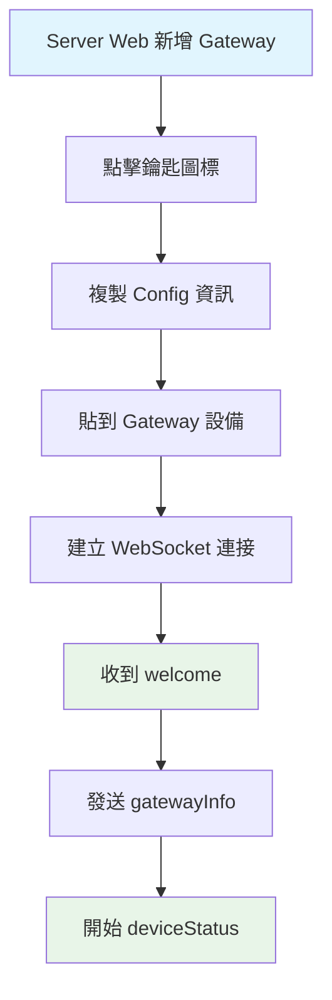
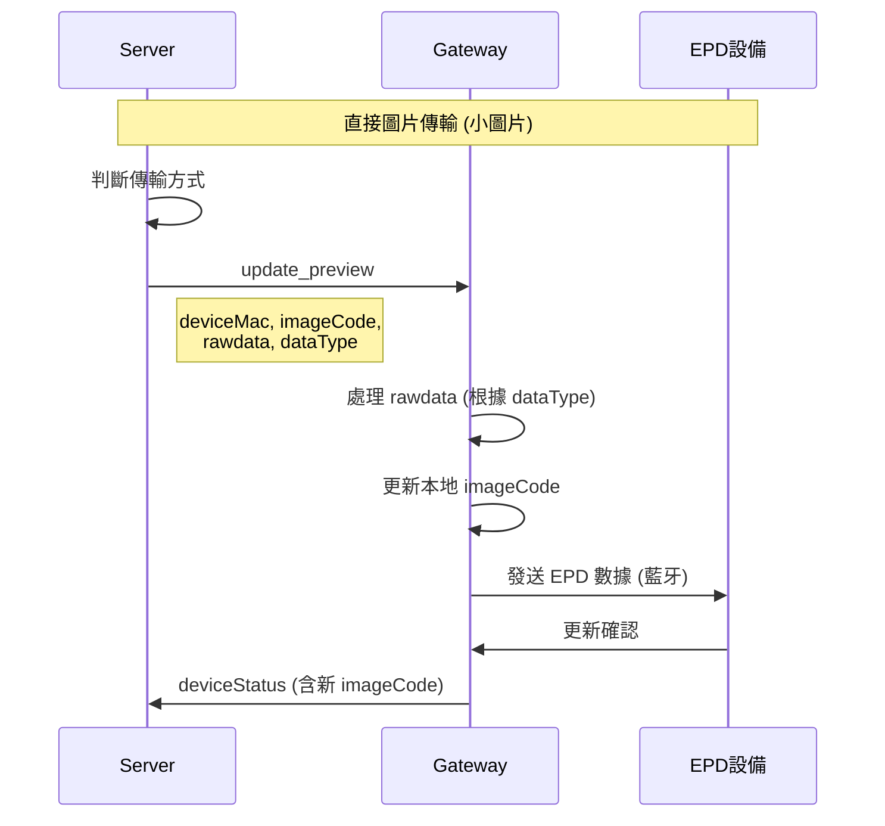
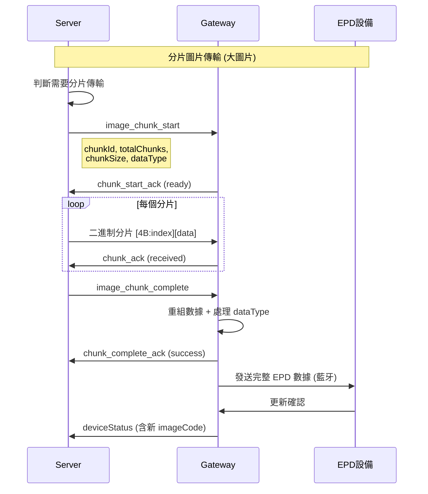
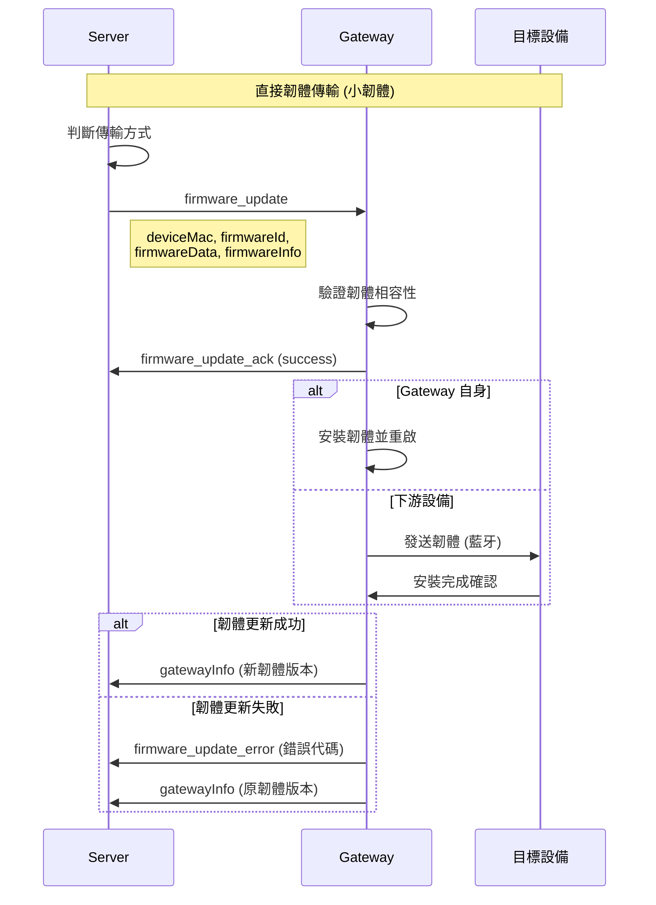
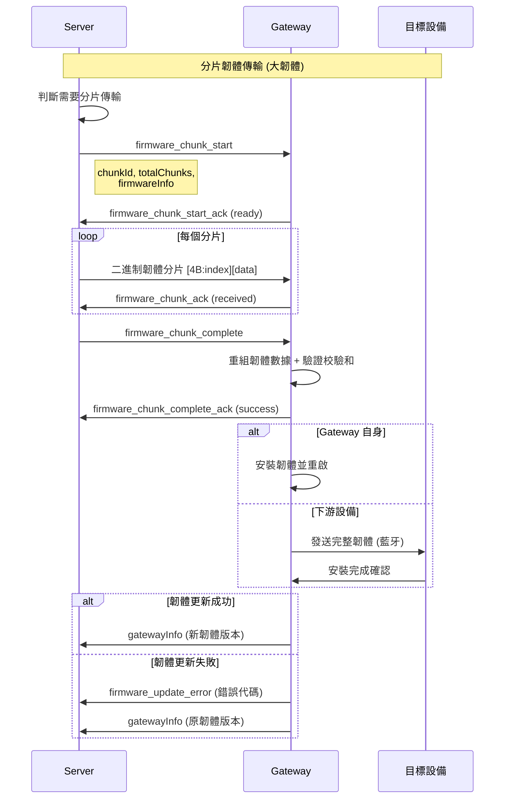

# Gateway/Device 快速參考手冊

## 🔄 操作流程



## 🚀 快速開始

### 1. 連接流程
```
1. 用戶在 Server Web 新增 Gateway
2. 點擊鑰匙圖標獲取編碼的 Config 資訊
3. 將編碼的 Config 貼到 Gateway 設備
4. Gateway 使用位元移位算法解碼 Config 資訊
5. Gateway 解析解碼後的 JSON 配置
6. Gateway 建立 WebSocket 連接: ws://server:port/ws?token=JWT_TOKEN
7. 收到 welcome 消息後發送 gatewayInfo
8. 開始定期發送 ping (25秒) 和 deviceStatus (5秒)
```

### 2. 必要的消息類型
- **發送**: `ping`, `gatewayInfo`, `deviceStatus`, `chunk_start_ack`, `chunk_ack`, `chunk_complete_ack`, `firmware_chunk_start_ack`, `firmware_chunk_ack`, `firmware_chunk_complete_ack`, `firmware_update_ack`, `firmware_update_error`
- **接收**: `welcome`, `pong`, `gatewayInfoAck`, `deviceStatusAck`, `update_preview`, `image_chunk_start`, `image_chunk_complete`, `firmware_chunk_start`, `firmware_update`, `firmware_chunk_complete`
- **二進制**: 分片數據（嵌入式 Index 模式）- 圖片和韌體

## 📨 消息格式速查

### 發送消息 (Gateway → Server)

**重要說明**: 韌體更新結果通過 `gatewayInfo` 中的韌體版本變化來確認。

#### ping (心跳)
```json
{
  "type": "ping",
  "timestamp": 1640995200000
}
```
**頻率**: 每 25 秒

#### gatewayInfo (網關信息)
```json
{
  "type": "gatewayInfo",
  "info": {
    "macAddress": "AA:BB:CC:DD:EE:FF",  // 必須與 Token 中的 MAC 一致
    "model": "Gateway Module 003",
    "hardwareVersion": "1.0.0.1",
    "wifiFirmwareVersion": "1.0.0",
    "btFirmwareVersion": "2.0.0",
    "ipAddress": "192.168.1.100",

    // 新增：分片傳輸能力支援
    "chunkingSupport": {
      "enabled": true,                 // 是否支援分片傳輸
      "maxChunkSize": 200,            // 每個分片的最大大小（4 bytes - 512KB）
      "maxSingleMessageSize": 10240,  // 單次 JSON 訊息的最大大小限制（bytes）
      "embeddedIndex": true,          // 是否支援嵌入式 Index 模式
      "jsonHeader": true,             // 是否支援 JSON Header 模式（向後兼容）
      "supportedFormat": "rawdata"    // 偏好的 rawdata 格式：rawdata, runlendata
    }
  }
}
```
**發送時機**: 收到 welcome 後立即發送，之後每 30 秒
**字段說明**:
- `macAddress`: 網關 MAC 地址 (必須與 Token 中的 MAC 一致)
- `model`: 網關模組 (如 "Gateway Module 003")
- `hardwareVersion`: 硬體版本 (x.x.x.x格式)
- `wifiFirmwareVersion`: WiFi 固件版本
- `btFirmwareVersion`: 藍牙固件版本
- `ipAddress`: 當前 IP 地址

**重要**: `chunkingSupport` 決定 Server 是否對該 Gateway 啟用分片傳輸

**分片決策邏輯**:
1. 如果 `rawdata 大小 > maxChunkSize` → 使用分片傳輸
2. 如果 `rawdata 大小 <= maxChunkSize` 但 `JSON 訊息大小 > maxSingleMessageSize` → 使用分片傳輸
3. 否則 → 使用直接傳輸 (`update_preview`)

#### deviceStatus (設備狀態)
```json
{
  "type": "deviceStatus",
  "devices": [
    {
      "macAddress": "11:22:33:44:55:66",
      "model": "EPD-2.9-BW",
      "hardwareVersion": "1.0.0.1",
      "firmwareVersion": "1.2.3",
      "status": "online",
      "data": {
        "size": "2.9\"",
        "battery": 85,
        "rssi": -65,
        "colorType": "BW",
        "imageCode": "12345678"  // 可選，只有本地有時才包含
      }
    }
  ]
}
```
**頻率**: 每 5 秒
**字段說明**:
- `macAddress`: 設備 MAC 地址 (必填)
- `model`: 設備模組 (如 "EPD-2.9-BW", "EPD-4.2-BWR")
- `hardwareVersion`: 硬體版本 (x.x.x.x格式)
- `firmwareVersion`: 韌體版本
- `status`: 設備狀態 ("online"/"offline")
- `data.size`: 螢幕尺寸 (如 "2.9\"", "4.2\"")
- `data.battery`: 電池電量 (0-100)
- `data.rssi`: 訊號強度 (dBm)
- `data.colorType`: 顏色類型 ("BW", "BWR")
- `data.imageCode`: 圖片代碼 (可選，只有本地有時才包含)

**注意**: 不包含 `dataId`，這是由前端或API控制的欄位

#### chunk_start_ack (分片開始確認)
```json
{
  "type": "chunk_start_ack",
  "chunkId": "chunk_12345",
  "status": "ready",
  "error": null,
  "timestamp": 1640995200000
}
```
**發送時機**: 收到 `image_chunk_start` 後立即發送
**status 值**: `"ready"` (準備就緒) | `"error"` (發生錯誤)

#### chunk_ack (分片確認)
```json
{
  "type": "chunk_ack",
  "chunkId": "chunk_12345",
  "chunkIndex": 5,
  "status": "received",
  "error": null,
  "timestamp": 1640995200000
}
```
**發送時機**: 收到每個分片數據後立即發送
**status 值**: `"received"` (已接收) | `"duplicate"` (重複) | `"error"` (錯誤)

#### chunk_complete_ack (分片完成確認)
```json
{
  "type": "chunk_complete_ack",
  "chunkId": "chunk_12345",
  "status": "success",
  "receivedSize": 9484,
  "error": null,
  "timestamp": 1640995200000
}
```
**發送時機**: 收到 `image_chunk_complete` 後立即發送
**status 值**: `"success"` (成功完成) | `"error"` (重組失敗)

#### firmware_chunk_start_ack (韌體分片開始確認)
```json
{
  "type": "firmware_chunk_start_ack",
  "chunkId": "firmware_chunk_12345",
  "status": "ready",
  "message": null,
  "timestamp": 1640995200000  // 統一使用數字格式
}
```
**發送時機**: 收到 `firmware_chunk_start` 後立即發送
**status 值**: `"ready"` (準備就緒) | `"error"` (錯誤)

#### firmware_update_error (韌體更新錯誤)
```json
{
  "type": "firmware_update_error",
  "deviceMac": "11:22:33:44:55:66",
  "firmwareId": "fw_abc123",
  "errorCode": "CHECKSUM_MISMATCH",
  "errorMessage": "韌體校驗失敗",
  "stage": "installing",
  "timestamp": 1640995200000  // 統一使用數字格式
}
```
**發送時機**: 韌體更新過程中發生錯誤時發送
**常見錯誤代碼**:
- `CHECKSUM_MISMATCH` - 校驗和不匹配
- `INSUFFICIENT_MEMORY` - 記憶體不足
- `INCOMPATIBLE_VERSION` - 版本不相容
- `UPDATE_FAILED` - 安裝失敗

**韌體更新結果回報**:
韌體更新的結果通過以下方式確認：
1. **立即確認**: `firmware_update_ack` 或 `firmware_chunk_complete_ack` 表示韌體接收完成
2. **最終結果**: 通過下次 `gatewayInfo` 消息中的韌體版本變化來確認
   - 成功: 韌體版本更新為新版本
   - 失敗: 韌體版本保持原版本

### 接收消息 (Server → Gateway)

#### welcome (歡迎)
```json
{
  "type": "welcome",
  "message": "WebSocket 連接成功",
  "timestamp": 1640995200000,
  "gatewayInfo": {
    "gatewayId": "gateway_id",
    "storeId": "store_id",
    "macAddress": "AA:BB:CC:DD:EE:FF"
  }
}
```
**處理**: 收到後立即發送 gatewayInfo

#### pong (心跳回應)
```json
{
  "type": "pong",
  "timestamp": 1640995200000,
  "serverTime": 1640995200100
}
```

#### update_preview (圖像更新 - 直接傳輸)
```json
{
  "type": "update_preview",
  "deviceMac": "11:22:33:44:55:66",
  "imageData": "data:image/png;base64,iVBORw0KGgo...",
  "imageCode": "87654321",
  "rawdata": [255, 255, 0, 128, 64, ...],  // EPD 原始數據陣列 (Uint8Array)
  "dataType": "runlendata",  // 數據格式類型：rawdata, runlendata 等
  "timestamp": 1640995200000,  // 統一使用數字格式
  // 當 dataType 為 "runlendata" 時的額外字段
  "compressionRatio": 65.2,    // 壓縮率百分比
  "originalSize": 9472,        // 原始數據大小（bytes）
  "compressedSize": 6180       // 壓縮後數據大小（bytes）
}
```
**處理**:
- 更新本地 imageCode，下次 deviceStatus 時包含新值
- 根據 `dataType` 處理 `rawdata` 中的數據
- `rawdata` 包含轉換後的 EPD 二進制數據，可直接發送到設備顯示

#### image_chunk_start (分片傳輸開始)
```json
{
  "type": "image_chunk_start",
  "chunkId": "chunk_12345",
  "deviceMac": "11:22:33:44:55:66",
  "imageCode": "87654321",
  "totalChunks": 48,
  "totalSize": 9484,
  "chunkSize": 200,
  "indexSize": 4,
  "dataType": "runlendata",  // 數據格式類型：rawdata, runlendata 等
  "mode": "embedded_index",
  "timestamp": 1640995200000,  // 統一使用數字格式
  // 當 dataType 為 "runlendata" 時的額外字段
  "compressionRatio": 65.2,    // 壓縮率百分比
  "originalSize": 9472,        // 原始數據大小（bytes）
  "compressedSize": 6180       // 壓縮後數據大小（bytes）
}
```
**處理**:
1. 準備接收分片數據
2. 記錄 `dataType` 以便後續正確處理數據
3. 發送 `chunk_start_ack` 確認
4. 等待二進制分片數據

#### image_chunk_complete (分片傳輸完成)
```json
{
  "type": "image_chunk_complete",
  "chunkId": "chunk_12345",
  "deviceMac": "11:22:33:44:55:66",
  "imageCode": "87654321",
  "totalChecksum": "a1b2",
  "timestamp": 1640995200000  // 統一使用數字格式
}
```
**處理**:
1. 驗證所有分片已接收
2. 重組完整數據
3. 更新本地 imageCode
4. 發送 `chunk_complete_ack` 確認

#### firmware_chunk_start (韌體分片傳輸開始)
```json
{
  "type": "firmware_chunk_start",
  "chunkId": "firmware_chunk_12345",
  "deviceMac": "11:22:33:44:55:66",
  "firmwareId": "fw_abc123",
  "totalChunks": 128,
  "totalSize": 524288,
  "chunkSize": 4096,
  "indexSize": 4,
  "dataType": "firmware",
  "mode": "embedded_index",
  "firmwareInfo": {
    "version": "2.1.0",
    "deviceType": "gateway",
    "model": "ESP32-S3",
    "functionType": "wifi",
    "checksum": "a1b2c3d4e5f6"
  },
  "timestamp": 1640995200000  // 統一使用數字格式
}
```
**處理**:
1. 準備接收韌體分片數據
2. 驗證韌體相容性（版本、模組等）
3. 發送 `firmware_chunk_start_ack` 確認
4. 等待二進制韌體分片數據

#### firmware_update (韌體直接更新)
```json
{
  "type": "firmware_update",
  "deviceMac": "11:22:33:44:55:66",
  "firmwareId": "fw_abc123",
  "firmwareData": [0x1F, 0x8B, 0x08, ...],
  "dataType": "firmware",
  "firmwareInfo": {
    "version": "2.1.0",
    "deviceType": "gateway",
    "model": "ESP32-S3",
    "functionType": "wifi",
    "checksum": "a1b2c3d4e5f6"
  },
  "timestamp": 1640995200000  // 統一使用數字格式
}
```
**處理**:
1. 驗證韌體相容性
2. 驗證校驗和
3. 發送 `firmware_update_ack` 確認
4. 開始韌體更新流程
5. 定期發送 `firmware_update_progress` 進度
6. 完成後發送 `firmware_update_complete`

#### firmware_chunk_complete (韌體分片傳輸完成)
```json
{
  "type": "firmware_chunk_complete",
  "chunkId": "firmware_chunk_12345",
  "deviceMac": "11:22:33:44:55:66",
  "firmwareId": "fw_abc123",
  "totalChecksum": "a1b2c3d4e5f6",
  "timestamp": 1640995200000  // 統一使用數字格式
}
```
**處理**:
1. 驗證所有韌體分片已接收
2. 重組完整韌體數據
3. 驗證總校驗和
4. 發送 `firmware_chunk_complete_ack` 確認
5. 開始韌體更新流程

## 🔐 WebSocket 登入資訊編碼解碼

### 編碼機制
- **基礎編碼**: Base64
- **位元操作**: 位元移位 (右移1位，LSB移至MSB)
- **無需外部函式庫**: 使用內建功能
- **輕量級**: 處理速度快

### 原始配置格式 (編碼前)
```json
{
  "url": "ws://192.168.0.185:3001/ws/store/KH001/gateway/689af2455583fa72878cff64",
  "path": "/ws/store/KH001/gateway/689af2455583fa72878cff64",
  "token": "eyJhbGciOiJIUzI1NiIsInR5cCI6IkpXVCJ9...",
  "protocol": "json"
}
```

### 編碼後格式
```
VGhpcyBpcyBhbiBlbmNvZGVkIHN0cmluZyBleGFtcGxl...
```

### Python 解碼範例
```python
import base64
import json

def decode_ws_info(encoded_data: str) -> dict:
    # 1. 解碼外層 Base64
    encoded_bytes = base64.b64decode(encoded_data)

    # 2. 反向位元移位操作
    decoded_bytes = bytearray()
    for byte in encoded_bytes:
        msb = (byte & 0x80) >> 7    # 取得最高位元
        shifted = (byte & 0x7F) << 1 # 左移 1 位
        decoded = shifted | msb      # MSB 移至 LSB
        decoded_bytes.append(decoded)

    # 3. 轉換為字串並解碼 Base64
    base64_string = decoded_bytes.decode('ascii')
    json_string = base64.b64decode(base64_string).decode('utf-8')

    # 4. 解析 JSON
    return json.loads(json_string)

# 使用範例
encoded_config = "從剪貼板獲取的編碼字串"
ws_config = decode_ws_info(encoded_config)
```

### C++ 解碼範例
```cpp
#include <string>
#include <vector>
#include <json/json.h>

Json::Value decodeWebSocketInfo(const std::string& encodedData) {
    // 1. 解碼外層 Base64
    std::vector<unsigned char> encodedBytes = base64_decode(encodedData);

    // 2. 反向位元移位操作
    std::vector<unsigned char> decodedBytes;
    for (unsigned char encoded : encodedBytes) {
        unsigned char msb = (encoded & 0x80) >> 7;    // 取得最高位元
        unsigned char shifted = (encoded & 0x7F) << 1; // 左移 1 位
        unsigned char decoded = shifted | msb;          // MSB 移至 LSB
        decodedBytes.push_back(decoded);
    }

    // 3. 轉換為字串並解碼 Base64
    std::string base64String(decodedBytes.begin(), decodedBytes.end());
    std::vector<unsigned char> jsonBytes = base64_decode(base64String);
    std::string jsonString(jsonBytes.begin(), jsonBytes.end());

    // 4. 解析 JSON
    Json::Value root;
    Json::Reader reader;
    reader.parse(jsonString, root);

    return root;
}
```

## 📊 數據格式處理

### dataType 格式說明
- **`"rawdata"`**: 未壓縮的原始 EPD 數據，直接使用
- **`"runlendata"`**: 使用 Run-Length Encoding 壓縮的數據，需要解壓縮

### 壓縮率自動回退機制
- Server 會自動計算壓縮率（包含 ImageInfo 大小變化）
- 當壓縮率 > 99% 時，自動回退到 `rawdata` 格式
- 確保傳輸效率，避免壓縮效果不佳時的額外開銷

### 壓縮率參數（僅當 dataType 為 "runlendata" 時提供）
- `compressionRatio`: 壓縮率百分比（例如：65.2 表示壓縮到原始大小的 65.2%）
- `originalSize`: 原始數據大小（bytes）
- `compressedSize`: 壓縮後數據大小（bytes）

### RLE 編碼格式
1. **重複序列** (runLength >= 2):
   - 格式: `[runLength, value]`
   - runLength 範圍: 2-127 (0x02-0x7F)，bit7 = 0

2. **非重複序列** (runLength = 1 或無重複):
   - 格式: `[0x80|length, data...]`
   - length 範圍: 1-127 (0x01-0x7F)，bit7 = 1

**重要**:
- bit7 是最高位元 (MSB)
- 壓縮的只有 EPD 像素數據，不包含 ImageInfo 結構頭部
- runlendata 格式的 ImageInfo 為 16 bytes（包含 datalen 字段），rawdata 格式為 12 bytes
- 不包含 chunk 的 index 資訊

### 數據處理流程
```python
def process_data(rawdata, data_type):
    if data_type == "rawdata":
        return rawdata  # 直接使用
    elif data_type == "runlendata":
        # 分離 ImageInfo (16 bytes，包含 datalen) 和壓縮的像素數據
        extended_image_info = rawdata[:16]
        compressed_pixels = rawdata[16:]
        # 解壓縮像素數據
        decompressed_pixels = decompress_rle(compressed_pixels)
        # 提取標準的 ImageInfo（前 12 bytes，不包含 datalen）
        standard_image_info = extended_image_info[:12]
        # 重新組合（使用標準的 12 bytes ImageInfo）
        return standard_image_info + decompressed_pixels
```

## ⚠️ 重要注意事項

### 1. MAC 地址安全
- `gatewayInfo` 中的 `macAddress` 必須與 JWT Token 中的完全一致
- 不匹配會導致連線被強制中斷並記錄安全事件

### 2. dataId 和 imageCode 處理
- **dataId**: 不應包含在設備回報中，這是由前端或API控制的欄位
- **imageCode**: 設備回報時不主動包含 `imageCode`
- 只有在收到 Server 圖像更新後才在本地存儲 `imageCode`
- 下次 `deviceStatus` 回報時包含更新後的 `imageCode`

### 3. 分片傳輸機制
- **兩階段決策**: Server 根據 `maxChunkSize` 和 `maxSingleMessageSize` 兩階段判斷是否啟用分片
- **第一階段**: 檢查 rawdata 大小是否超過 `maxChunkSize`
- **第二階段**: 檢查完整 JSON 訊息大小是否超過 `maxSingleMessageSize`
- **嵌入式 Index**: 每個分片前 4 bytes 包含 chunkIndex (little-endian)
- **ACK 機制**: 每個分片必須等待 Gateway 確認後才發送下一個
- **性能警告**: 當分片數量 > 100 時，系統會發出性能警告
- **硬體限制支援**: 支援 4 bytes - 512KB 的分片大小範圍

### 4. 分片數據格式
```
[4 bytes: chunkIndex][N bytes: 實際數據]
```
- **chunkIndex**: 32位無符號整數，little-endian 格式
- **實際數據**: EPD 原始數據的一部分

### 5. status 和 error 參數說明

**status 參數** - 表示操作的執行狀態：
- **分片相關**:
  - `"ready"`: 準備就緒（chunk_start_ack）
  - `"received"`: 已成功接收（chunk_ack）
  - `"duplicate"`: 重複分片（chunk_ack）
  - `"success"`: 操作成功完成（chunk_complete_ack）
  - `"error"`: 操作失敗

**error 參數** - 提供具體錯誤信息：
- 當 `status` 為 `"error"` 時，包含具體的錯誤描述
- 當操作成功時，通常為 `null`
- 幫助調試和錯誤追蹤

### 6. 超時設定

**Server 端等待 Gateway 回應的超時時間**：
- **Start ACK timeout**: 60秒 (chunk_start_ack, firmware_chunk_start_ack)
- **Chunk ACK timeout**: 5秒 (chunk_ack, firmware_chunk_ack)
- **Complete ACK timeout**: 60秒 (chunk_complete_ack, firmware_chunk_complete_ack)

**重要說明**：
- Start ACK 和 Complete ACK 超時時間較長（60秒），因為 Gateway 需要時間重組數據和處理
- 如果 Gateway 無法在超時時間內回應，Server 會標記傳輸失敗
- Gateway 應盡快發送 ACK 回應，避免超時

### 7. 錯誤處理
```json
{
  "type": "gatewayInfoAck",
  "success": false,
  "fatal": true,  // 如果為 true，連線將被中斷
  "message": "MAC地址不匹配，連線已中斷"
}
```

## ❌ 失敗狀況速查

### 連接階段失敗
| 錯誤 | 狀態碼 | 原因 | 解決方法 |
|------|--------|------|----------|
| Token 驗證失敗 | 401 | Token 無效/過期 | 重新獲取 Config |
| Token 類型錯誤 | 401 | 非 gateway 類型 | 檢查 Token 來源 |
| Gateway ID 不匹配 | 403 | URL 與 Token 不符 | 檢查 Gateway 配置 |
| Store ID 不匹配 | 403 | 門店 ID 不符 | 檢查門店權限 |
| MAC 地址缺失 | 403 | Token 無 MAC | 重新生成 Token |

### 運行階段失敗
| 消息類型 | success | fatal | 錯誤原因 | 處理方式 |
|----------|---------|-------|----------|----------|
| gatewayInfoAck | false | true | MAC 地址不匹配 | 停止重連，檢查配置 |
| gatewayInfoAck | false | false | 網關被刪除 | 重新註冊網關 |
| gatewayInfoAck | false | false | 信息格式錯誤 | 檢查消息格式 |
| deviceStatusAck | false | - | 設備列表無效 | 檢查設備數據 |
| error | - | - | 未知消息類型 | 檢查消息格式 |

### 心跳檢測失敗
| 狀況 | 觸發條件 | 關閉代碼 | 處理方式 |
|------|----------|----------|----------|
| 心跳超時 | >30秒無ping | 1000 | 檢查網絡，重連 |
| 長時間無活動 | >60秒無消息 | 1000 | 檢查程序狀態 |

## � 函數呼叫時序圖

### 🖼️ 圖片傳輸時序圖

#### 直接圖片傳輸


#### 分片圖片傳輸


### 🔧 韌體傳輸時序圖

#### 直接韌體傳輸


#### 分片韌體傳輸


## 🔗 相關文檔

- [完整實作指南](./Gateway-Device-Implementation-Guide.md)

---

**最後更新**: 2025年10月
**版本**: 2.6.0 - WebSocket 登入資訊編碼版
**新功能**:
- 嵌入式 Index 分片傳輸
- Gateway 能力上報機制
- 硬體限制支援 (4 bytes - 512KB)
- 性能警告系統
- **dataType 欄位統一**: 使用 `dataType` 取代 `rawdataFormat`
- **RLE 壓縮支援**: 完整的 Run-Length Encoding 實作指南
- **數據處理流程**: 詳細的壓縮數據處理說明
- **兩階段分片決策**: 新增 `maxSingleMessageSize` 參數，支援更智能的分片決策
- **JSON 訊息大小檢查**: 當 rawdata 小但 JSON 訊息大時自動切換到分片傳輸
- **📊 函數呼叫時序圖**: 新增圖片傳輸和韌體傳輸的詳細時序圖
- **🖼️ 圖片傳輸流程**: 直接傳輸和分片傳輸的完整時序圖
- **🔧 韌體傳輸流程**: 直接傳輸和分片傳輸的完整時序圖
- **📋 測試步驟增強**: 新增分片傳輸測試項目
- **🔧 韌體更新流程修正**: 明確 Gateway 不需要發送 `firmware_update_progress` 和 `firmware_update_complete`
- **📊 韌體結果確認**: 韌體更新結果通過 `gatewayInfo` 中的韌體版本變化確認
- **🚨 錯誤處理增強**: 新增 `firmware_update_error` 消息支援，Gateway 可主動報告韌體更新錯誤
- **⏱️ ACK Timeout 機制**: 完善的 timeout 處理，確保傳輸問題能正確告知用戶
- **🧪 錯誤模擬功能**: test-ws-client-interactive.js 新增 `firmware-error` 命令支援錯誤測試
- **🔐 WebSocket 登入資訊編碼**: 新增 Base64 + 位元移位編碼機制，無需外部函式庫
- **📋 編碼解碼文件**: 提供完整的 Python、C++、JavaScript 解碼範例程式碼
- **🔧 Gateway 整合指南**: 詳細說明如何在 Gateway 中整合解碼功能
- **❓ 編碼相關常見問題**: 新增解碼失敗、實作細節等常見問題解答
