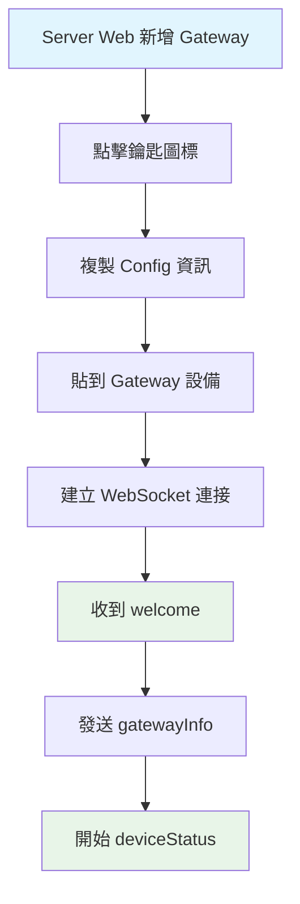

# Gateway/Device 快速參考手冊

## 🔄 操作流程



## 🚀 快速開始

### 1. 連接流程
```
1. 用戶在 Server Web 新增 Gateway
2. 點擊鑰匙圖標獲取 Config 資訊
3. 將 Config 貼到 Gateway 設備
4. Gateway 建立 WebSocket 連接: ws://server:port/ws?token=JWT_TOKEN
5. 收到 welcome 消息後發送 gatewayInfo
6. 開始定期發送 ping (25秒) 和 deviceStatus (5秒)
```

### 2. 必要的消息類型
- **發送**: `ping`, `gatewayInfo`, `deviceStatus`
- **接收**: `welcome`, `pong`, `gatewayInfoAck`, `deviceStatusAck`, `update_preview`

## 📨 消息格式速查

### 發送消息 (Gateway → Server)

#### ping (心跳)
```json
{
  "type": "ping",
  "timestamp": 1640995200000
}
```
**頻率**: 每 25 秒

#### gatewayInfo (網關信息)
```json
{
  "type": "gatewayInfo",
  "info": {
    "macAddress": "AA:BB:CC:DD:EE:FF",  // 必須與 Token 中的 MAC 一致
    "model": "Gateway Model 003",
    "wifiFirmwareVersion": "1.0.0",
    "btFirmwareVersion": "2.0.0",
    "ipAddress": "192.168.1.100"
  }
}
```
**發送時機**: 收到 welcome 後立即發送，之後每 30 秒

#### deviceStatus (設備狀態)
```json
{
  "type": "deviceStatus",
  "devices": [
    {
      "macAddress": "11:22:33:44:55:66",
      "status": "online",
      "data": {
        "size": "2.9\"",
        "battery": 85,
        "rssi": -65,
        "colorType": "BW",
        "imageCode": "12345678"  // 可選，只有本地有時才包含
      }
    }
  ]
}
```
**頻率**: 每 5 秒
**注意**: 不包含 `dataId`，這是由前端或API控制的欄位

### 接收消息 (Server → Gateway)

#### welcome (歡迎)
```json
{
  "type": "welcome",
  "message": "WebSocket 連接成功",
  "timestamp": 1640995200000,
  "gatewayInfo": {
    "gatewayId": "gateway_id",
    "storeId": "store_id",
    "macAddress": "AA:BB:CC:DD:EE:FF"
  }
}
```
**處理**: 收到後立即發送 gatewayInfo

#### pong (心跳回應)
```json
{
  "type": "pong",
  "timestamp": 1640995200000,
  "serverTime": 1640995200100
}
```

#### update_preview (圖像更新)
```json
{
  "type": "update_preview",
  "deviceMac": "11:22:33:44:55:66",
  "imageData": "data:image/png;base64,iVBORw0KGgo...",
  "imageCode": "87654321",
  "rawdata": [255, 255, 0, 128, 64, ...],  // EPD 原始數據陣列 (Uint8Array)
  "timestamp": "2021-12-31T16:00:00.000Z"
}
```
**處理**: 更新本地 imageCode，下次 deviceStatus 時包含新值

## ⚠️ 重要注意事項

### 1. MAC 地址安全
- `gatewayInfo` 中的 `macAddress` 必須與 JWT Token 中的完全一致
- 不匹配會導致連線被強制中斷並記錄安全事件

### 3. 錯誤處理
```json
{
  "type": "gatewayInfoAck",
  "success": false,
  "fatal": true,  // 如果為 true，連線將被中斷
  "message": "MAC地址不匹配，連線已中斷"
}
```

## ❌ 失敗狀況速查

### 連接階段失敗
| 錯誤 | 狀態碼 | 原因 | 解決方法 |
|------|--------|------|----------|
| Token 驗證失敗 | 401 | Token 無效/過期 | 重新獲取 Config |
| Token 類型錯誤 | 401 | 非 gateway 類型 | 檢查 Token 來源 |
| Gateway ID 不匹配 | 403 | URL 與 Token 不符 | 檢查 Gateway 配置 |
| Store ID 不匹配 | 403 | 門店 ID 不符 | 檢查門店權限 |
| MAC 地址缺失 | 403 | Token 無 MAC | 重新生成 Token |

### 運行階段失敗
| 消息類型 | success | fatal | 錯誤原因 | 處理方式 |
|----------|---------|-------|----------|----------|
| gatewayInfoAck | false | true | MAC 地址不匹配 | 停止重連，檢查配置 |
| gatewayInfoAck | false | false | 網關被刪除 | 重新註冊網關 |
| gatewayInfoAck | false | false | 信息格式錯誤 | 檢查消息格式 |
| deviceStatusAck | false | - | 設備列表無效 | 檢查設備數據 |
| error | - | - | 未知消息類型 | 檢查消息格式 |

### 心跳檢測失敗
| 狀況 | 觸發條件 | 關閉代碼 | 處理方式 |
|------|----------|----------|----------|
| 心跳超時 | >30秒無ping | 1000 | 檢查網絡，重連 |
| 長時間無活動 | >60秒無消息 | 1000 | 檢查程序狀態 |

## 🔗 相關文檔

- [完整實作指南](./Gateway-Device-Implementation-Guide.md)
---

**版本**: 1.0.0
